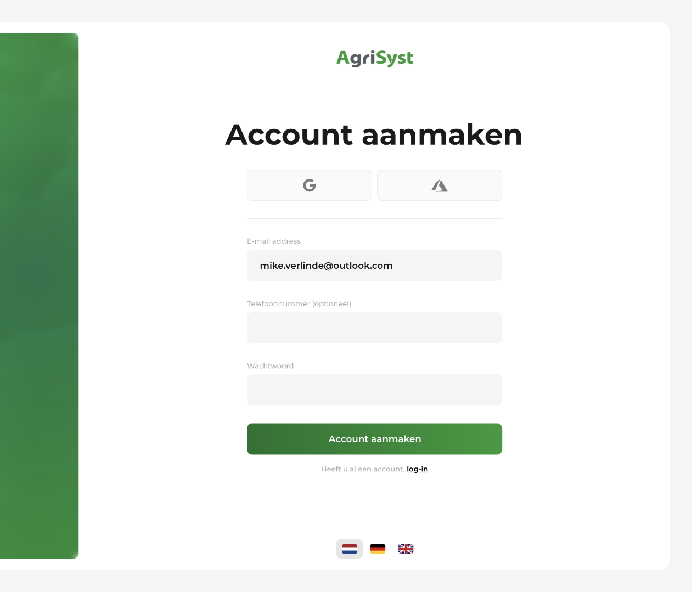

# AgriSyst
**Problem** 
AgriSyst supports pig farmers worldwide with applications for collecting and analyzing production data. Their legacy authentication system could no longer meet the scalability and security requirements of their growing multi-application environment.

**My Role** 
As a Software Engineer Intern, I independently researched, prototyped, and presented authentication solutions in agile sprints.

**Key contributions** 
Researched and compared authentication/authorization strategies: OAuth 2.0, OpenID Connect, SAML 2.0, single sign-on, multifactor authentication, JWT vs sessions, reverse proxies, encryption, and hashing
- Developed and evaluated three prototypes: (1) custom password-based system, (2) direct OAuth 2.0 implementation, and (3) a Keycloak solution
- Expanded the Keycloak prototype with MFA, LDAP/Active Directory integration, custom theming, and deployment scripts
- Designed a UI/UX aligned with AgriSyst’s new branding

**Impact** 
- Reduced projected costs of authentication infrastructure by ~95%
- Strengthened security following the latest OWASP guidelines

**Technology** 
`Keycloak`, `MySQL`, `Next.js`, `React`, `Express`, `Typescript`, `Node.js`, `Docker`, `HTML`, `CSS`

**Solution preview** 
Below is a screenshot of the custom-themed authentication portal:

