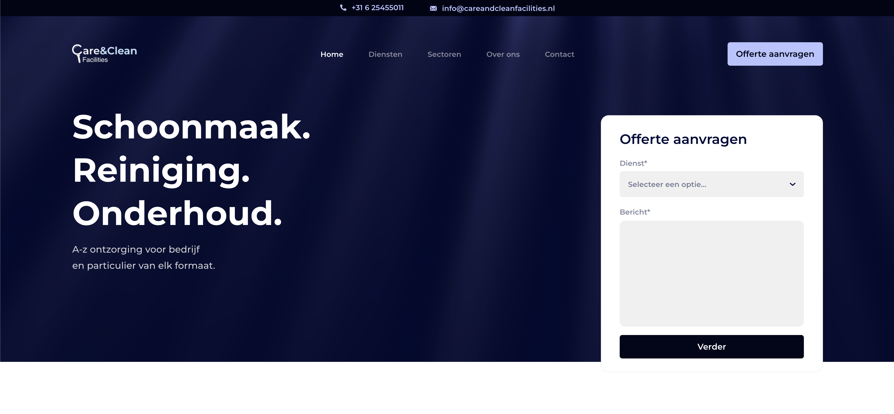
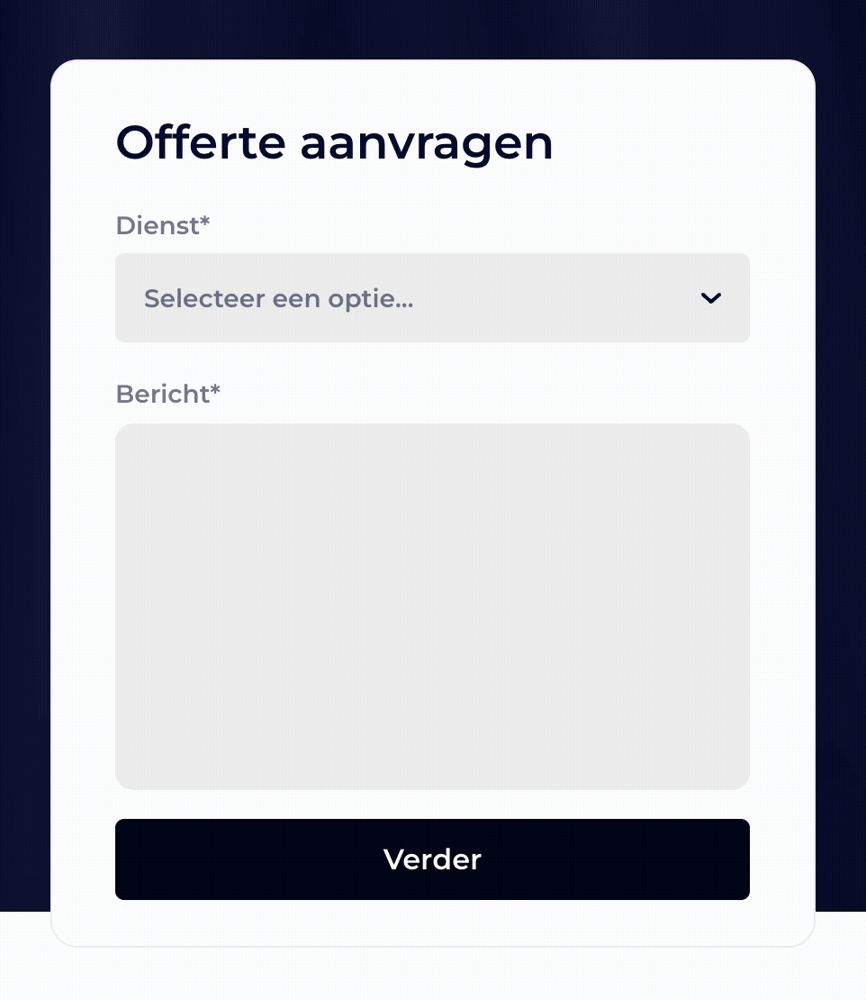

# Care & Clean Facilities
**Problem** 
As a newly founded cleaning company, Care & Clean Facilities needed a modern website to establish their online presence.

**My Role** 
As a Freelance Software Engineer, I designed and developed their website.

**Key Contributions** 
- Designed and developed a high-performance Next.js website tailored to their brand and services
- Implemented layered caching to maximize loading speed 
- Implemented the Intersection Observer API for optimized animations and interactivity
- Animated contact form with client- and server-side validation

**Impact** 
- Achieved a 10× faster speed index compared to their main competitor

**Technology** 
`Next.js`, `React`, `GSAP`, `Zod`, `Typescript`, `Figma`

**Solution Preview** 
The website of Care & Clean Facilities is live at: [careandcleanfacilities.nl](https://www.careandcleanfacilities.nl)

