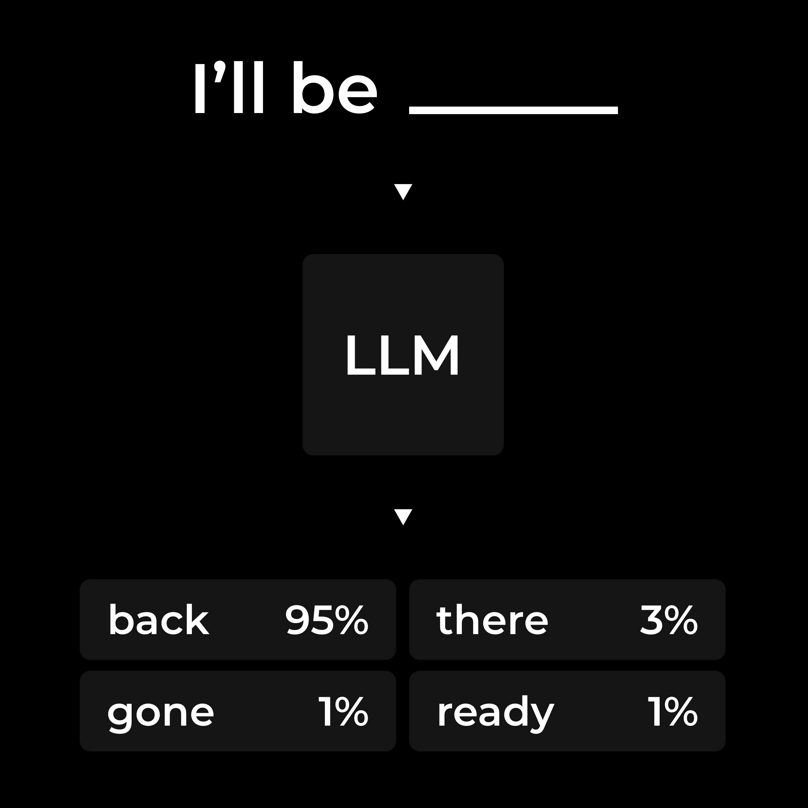

Humans are goal driven; computers require step-by-step instructions. Bridging this gap often demands domain expertise, time, and effort. Recent advances in AI and AI agents promise to change this, allowing us to interact with computers through natural language.

AI agents use tools to interact with their environment — for example, to retrieve real-time information or execute tasks on our behalf. Yet, their ability to leverage such tools remains limited. They can only manage a small set of tools, and adding more makes the agent less accurate, slower, less secure, and more expensive.

During my graduation internship project, summarized in this article, I researched the foundations of agentic AI — LLMs, reasoning frameworks, and agent architectures. Building on this, I designed and developed a novel context-aware agent architecture that supports highly scalable tool usage, overcoming the traditional limits of context windows and tool selection.

*I acquired a student-entrepreneur status at the Fontys Centrum voor Ondernemerschap (Center for Entrepreneurs) to independently complete this project from February 2025 to June 2025.* 

1. What is an AI agent?
2. Large Languages Models
3. Reasoning frameworks
4. Breaking the context barrier
5. Implementation details and architecture

## Chapter 1. What is an AI agent?
An AI agent is a software entity that extends a large language model with the ability to perceive, reason, and act. Concretely, this means it can:
- Process inputs from its environment (such as user prompts or retrieved data).
- Decide on a course of action based on internal reasoning.
- Execute that action by calling external tools.

At a high level, the architecture of an agent is composed of three modules: a model, an orchestration layer, and tools. The model serves as the brain of the operation, while the orchestration layer provides structure — introducing memory and eliciting more reliable reasoning and planning. Finally, tools allow the agent to interact with its environment. In practice, both AI agents and the frameworks used to build them are rapidly evolving. To understand their current limitations, we first need to examine the foundation they rely on: the large language model.

## Chapter 2. Large Language Models
LLMs are large mathematical models that capture statistical patterns in our natural language to generate text. With their ability to simulate reasoning and planning (an emergent effect of large-scale training), they form the core of AI agents. 

Conceptually, an LLM internalizes the statistical regularities of a vast corpus (collection of texts) presented during training. In other words, it learns parameters that encode co-occurrence and contextual relationships. To generate text, it takes a sequence of words (or parts of words) and predicts what is most likely to come next. Important to note is that this allows an LLM to simulate reasoning and planning. It predicts outputs that resemble reasoning because such patterns appear in training data — not because it forms genuine world models or possesses true understanding.

Most modern LLMs are based on the transformer architecture introduced by Google in 2017 (Attention Is All You Need). It transforms input tokens into embeddings resembling their in-context meaning, used to output a probability distribution for the next token. A transformer is composed of multiple layers, of which the following is a simplified and conceptual representation:
- **Tokenizer:** splits the input into discrete tokens.
- **Embedding matrix:** maps each token to a high-dimensional vector representation (embedding).
- **Positional encoding:** encodes the order of the input tokens into their embedding.
- **Attention blocks:** each token attends to others to build contextual relationships, again encoded into their embeddings.
- **Multilayer perceptron (MLP / Feed-forward):** enriches the representation of each embedding independently. 
- **Unembedding matrix:** maps the final embeddings back to token probabilities, predicting the most likely next token.

Understanding this structure is crucial because it reveals both the strengths and limitations of LLMs as agents. Their strength lies in generalization across domains. But limitations — such as a finite context window and a lack of grounded knowledge — constrain their effectiveness in practice. These weaknesses motivate the reasoning frameworks that extend an LLM into a more capable agent, which we'll explore in the next chapter.

## Chapter 3. Reasoning frameworks
Reasoning frameworks are paradigms that elicit multi-step reasoning and planning behavior from an LLM, with or without external tools. This enhances an agent's ability to solve complex problems without changing the underlying LLM.

### 3.1 Internal reasoning frameworks
Internal reasoning frameworks rely purely on prompt engineering to guide the model's "thought process". Instead of jumping directly to an answer, the model is encouraged to generate intermediate steps that make its reasoning more explicit and reliable. Some examples are:
- **Chain-of-Thought (CoT):** breaks a problem into sequential steps, encouraging step-by-step deduction rather than single-shot guessing.
- **Tree of Thoughts (ToT):** explores multiple partial solutions branching out like a search tree. The model evaluates different paths, prunes weaker ones, and converges on a more reliable answer.
- **Diversity of Thought (DoT):** while approaches like Chain-of-Thought with Self-Consistency (CoT-SC) or ToT introduce token-level diversity, DoT encourages distinct reasoning strategies at the approach level.

### 3.2 External reasoning frameworks
External reasoning frameworks extend an LLM’s capabilities by integrating external tools. These tools enable the model to fetch up-to-date information or perform concrete actions in the environment. Some examples are:
- **ReAct:** interleaves internal reasoning with external tools via a think-act-observe loop.
- **ReWOO:** separates responsibilities into planner, worker, and solver modules. The agent generates a plan upfront, executes tool calls accordingly, and then produces a final answer.
- **Plan-and-Execute:** takes a hybrid approach. The agent creates a multi-step plan at the start but revisits and adjusts it after each execution step.

Reasoning frameworks are rapidly transforming how LLMs approach complex problems and leverage tools. In the next chapter, we shift focus from their potential to their current limitations and introduce a novel architecture designed to overcome it.

## Chapter 4. Breaking the context barrier
Reasoning frameworks form the backbone of today's agentic systems, but they still face an architectural constraint limiting their reliability, scalability, and cost-effectiveness: the context window. This limitation becomes more pronounced as agents are asked to handle broader tasks or integrate larger toolsets. This motivated the design of a new, context-aware architecture that addresses the major bottleneck of the context window.

### 4.1 Key limitation: the context window
The context window refers to the amount of information the LLM can work with at once. This includes:
- Your messages to the LLM (including files)
- The tools available to the LLM
- The reasoning and responses from the LLM

A larger context window results in:
- **Higher computational costs:** a larger context size makes the system significantly more expensive and slower.
- **Degraded performance:** within a large context, the LLM struggles to extract the relevant information as irrelevant or redundant text accumulates. Moreover, as you approach the context limit, the LLM has less space to generate detailed, step-by-step outputs (simulated reasoning), which often results in shorter, less accurate answers.
- **Safety concerns:** adversarial prompts or hidden instructions can be buried deep in the input, making them harder for the LLM's safety mechanisms to detect and filter out.

This is why today’s agents can only handle a small toolset. Even OpenAI advises: "Keep the number of functions small for higher accuracy. Aim for fewer than 20 functions at any one time". Managing the context window efficiently is essential for keeping costs down, maintaining speed, preserving reliability, and ensuring safety.

### 4.2 A novel context-aware agent architecture
My solution is a context-aware agent architecture built around semantic tool retrieval. Instead of exposing every tool to the LLM, the agent dynamically selects only the most relevant subset for each interaction. This decoupling enables agents to scale to arbitrarily large toolsets while avoiding the inefficiencies and security risks of overloaded inputs, ultimately enhancing their ability to reason flexibly across diverse domains.

The pipeline works as follows:
1. Each tool is embedded and stored in a vector database.
2. A query is constructed based on the conversation context.
3. The top-k most relevant tools are selected.
4. The LLM is exposed only to the top-k most relevant tools, plus a special reselect tool.
5. If the initial selection is insufficient, the LLM can describe the missing tool and retrieve it via the reselect mechanism.

The reselect step prevents the system from "getting stuck" with the wrong subset of tools, ensuring robustness even when the first retrieval is imperfect. The retrieval tool is dynamically available to prevent a loop when a tool is simply not available.

It is easy to tailor this approach to project-specific requirements, such as:
- Tool embeddings may include example use-cases, similar to few-shot Chain-of-Thought.
- The query may be the raw conversation context, or a semantic summary generated by a small language model.
- The number of tools (_k_) can be tuned for efficiency and reliability.

Finally, this semantic tool retrieval approach is not exclusive. It can be combined with optimization techniques such as fine-tuning and reinforcement learning, and it integrates naturally with a wide range of reasoning frameworks. In the next chapter, we move from agent architecture to implementation details.

## Chapter 5. Implementation details and architecture
The context-aware architecture described in the previous chapter was implemented in a full-stack web application. The system was designed to be both technically rigorous and user-friendly, combining best practices in modern web development with advanced agent orchestration.

### 5.1 System overview
The following technologies were used in the implementation:
- **Frontend:** Next.js, React, Typescript, deployed on Vercel.
- **Backend:** Express.js, TypeScript, containerized with Docker and deployed via CI/CD pipelines (GitHub Actions) following test-driven development.
- **Authentication:** Privy as identity broker, supporting Web3 wallets, Telegram, phone, and email.
- **AI agent:** LangGraph, with OpenAI as the LLM and embedding provider.
- **UI/UX design:** AdobeXD and Figma

### 5.2 Frontend
The frontend provides a responsive and interactive interface, featuring:
- **Streaming results:** LLM responses are streamed token-by-token to the client.
- **Animations:** smooth UX powered by CSS keyframes and GSAP animations.
- **Wallet integration:** automatic creation and management of a Privy-powered self-custody wallet (exportable).
- **Notification system**: custom implementation via the Event Emitter pattern, ensuring global availability without relying on React Context wrappers.

Modern Next.js features were leveraged, including server actions, streaming components with suspense, layered caching strategies (request memoization, data caching, full-route caching, and route caching), and authentication middleware. Validation occurred at three levels: live client-side (debounced), submit-time checks, and server-side enforcement.

### 5.3 Backend
The backend powered both profile management and agent orchestration. Key practices included:
- **Test-driven development:** reliability ensured from the ground up.
- **CI/CD pipelines:** automated testing, builds, and deployments.
- **Containerization with Docker:** multi-stage Docker images for lightweight, consistent environments.
- **Privy webhooks:** to handle real-time updates from the identity broker. 
- **Validation:** Zod enforced type-safe input at the API boundary.
- **Databases:** MongoDB (NoSQL) and CockroachDB (SQL), integrated via Prisma ORM.

### 5.4 Authentication and Web3 wallets
Privy served as the identity broker, connecting Web3 wallets, Telegram, phone, and email providers. Each user was automatically provisioned with a **self-custody wallet**, which could be exported if desired. Delegated actions allowed users to control whether the agent could sign transactions on their behalf.

### 5.5 AI agent
The agent was built with LangGraph, implementing the semantic tool retrieval and reselect mechanisms described in Chapter 4. Embeddings and vector search powered tool selection, while OpenAI provided the LLM. Although provider-agnostic by design, this implementation demonstrated the architecture’s viability with a state-of-the-art commercial stack.

### 5.6 UI/UX design

---

I look back very positively on this project. It gave me a deep understanding of agentic AI and its foundational concepts. By designing, implementing, and deploying the entire system, I learned how abstract ideas like tool retrieval, orchestration, and context management can be translated into concrete engineering decisions. This experience now allows me to confidently turn future project requirements into optimized AI-powered applications.

*Note: much of the theoretical depth was omitted from this article, such as: ACI, attention mechanisms, backpropagation, embeddings, fine-tuning, indexing methods, mathematics of a transformer, MCP, model evaluation, other reasoning frameworks, RAFT, RAG, reinforcement learning for improved reasoning, etc.*