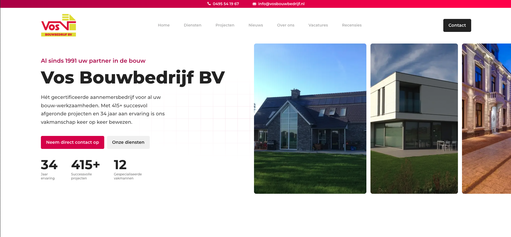
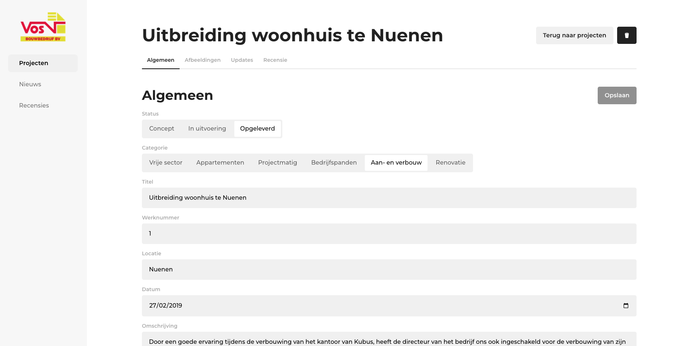
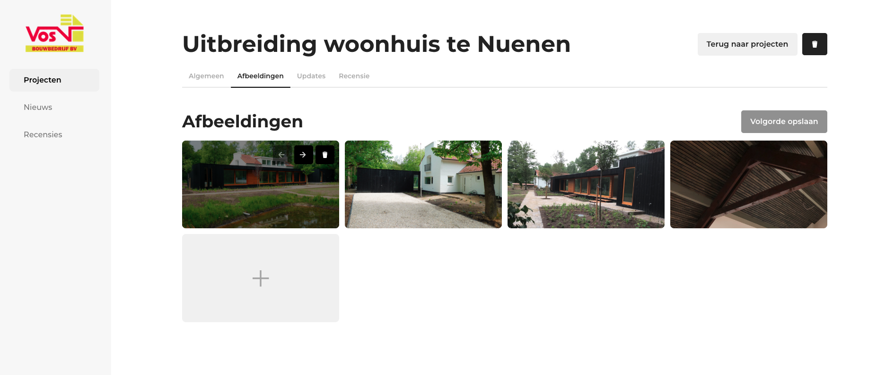
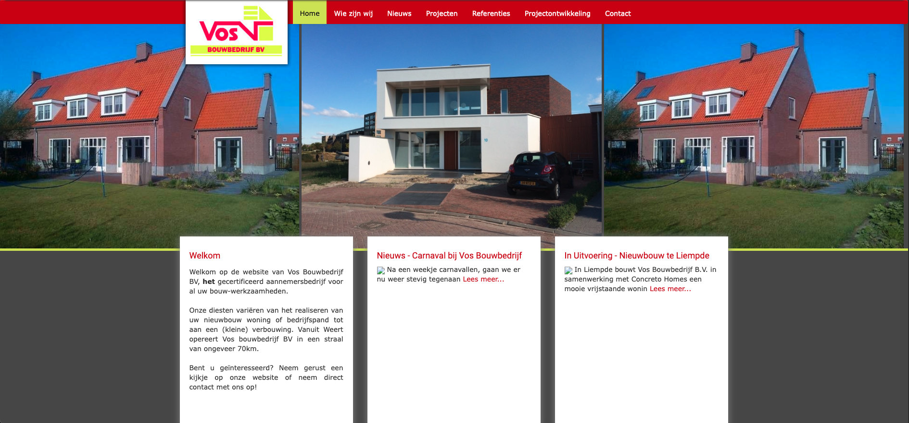

# Vos Bouwbedrijf
**Problem** 
Vos Bouwbedrijf, a construction company in the Netherlands, relied on a legacy CMS that didn’t match their workflow. Content updates were time-consuming, and the outdated website had poor performance and user experience.

**My Role** 
As a Freelance Full-Stack Developer, I designed and developed a new website and custom CMS.

**Key Contributions** 
- Rebuilt the website and CMS as a modern full-stack Next.js application
- Implemented layered caching to maximize speed and efficiency
- Designed an admin interface tailored to their internal workflow

**Impact** 
- Reduced content management time by 55%
- Improved website load speed by ~80%

**Technology** 
`Next.js`, `React`, `GSAP`, `Typescript`, `MongoDB`, `Prisma`, `CSS`

**Solution Preview** 
The website of Vos Bouwbedrijf is live at: [vosbouwbedrijf.nl](https://vosbouwbedrijf.nl)

The CMS, tailored to the workflow of Vos Bouwbedrijf:

Screenshot of their old website

